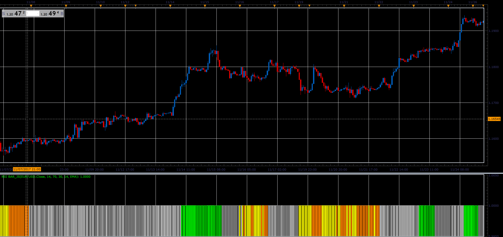

# RSI Bar

> Source: https://fxcodebase.com/code/viewtopic.php?f=48&t=65577  
> Forum: 48 · Topic 65577 · 1 post(s)

---

## RSI Bar

**Alexander.Gettinger** · Sat Jan 06, 2018 5:37 pm

The indicator changes color depending on whether we are above or below the central line,
in the overbought / oversold area.
We use smoothed data , if you use 1 as smoothing period, You'll have your regular RSI indicator, indication.

 

Download:

 [RSI Bar_JS.jsl](files/116856/RSI%20Bar_JS.jsl)
