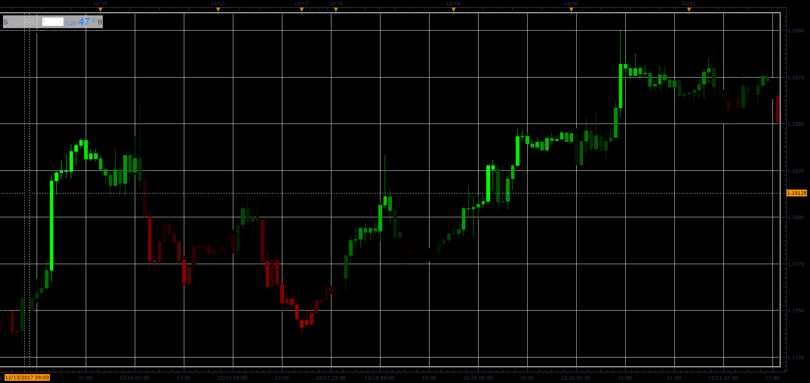

# RSI gradient candles

> Source: https://fxcodebase.com/code/viewtopic.php?f=48&t=65580  
> Forum: 48 · Topic 65580 · 1 post(s)

---

## RSI gradient candles

**Alexander.Gettinger** · Sat Jan 06, 2018 5:41 pm

The indicator paintes candles in accordance with the values ​​of the RSI oscillator.

 

Download:

 [RSI_Gradient_JS.jsl](files/116859/RSI_Gradient_JS.jsl)
