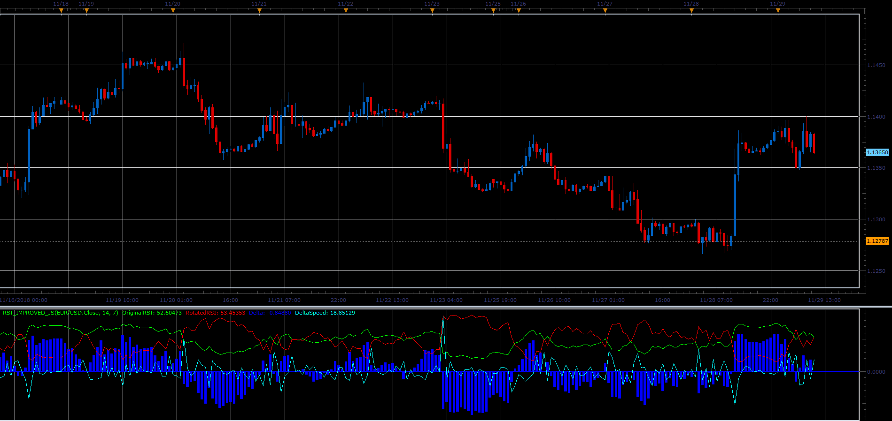

# RSI Improved

> Source: https://fxcodebase.com/code/viewtopic.php?f=48&t=67108  
> Forum: 48 · Topic 67108 · 1 post(s)

---

## RSI Improved

**Alexander.Gettinger** · Fri Dec 07, 2018 3:04 pm

Formulas:
OriginalRSI is a RSI(Original period),
RotatedRSI=100-RSI(Rotated period),
Delta=OriginalRSI-RotatedRSI,
DeltaSpeed=Delta[i-1]-Delta[i].

 

Download:

 [RSI_Improved_JS.jsl](files/122619/RSI_Improved_JS.jsl)
