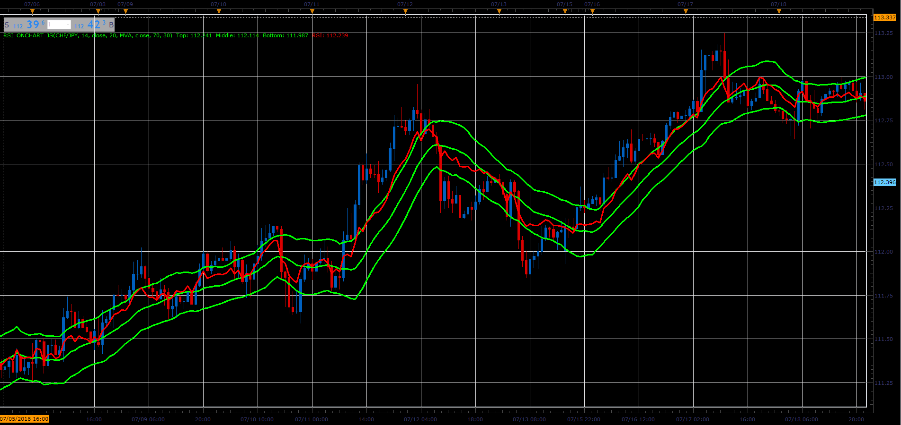

# RSI on chart

> Source: https://fxcodebase.com/code/viewtopic.php?f=48&t=66988  
> Forum: 48 · Topic 66988 · 1 post(s)

---

## RSI on chart

**Alexander.Gettinger** · Sat Nov 24, 2018 3:23 pm

Indicator draw RSI oscillator on data chart with RSI levels.
As center line uses MA.

 

Download:

 [RSI_OnChart_JS.jsl](files/122317/RSI_OnChart_JS.jsl)

For this indicator must be installed AVERAGES indicator ([viewtopic.php?f=17&t=2430](https://fxcodebase.com/code/viewtopic.php?f=17&t=2430)).
