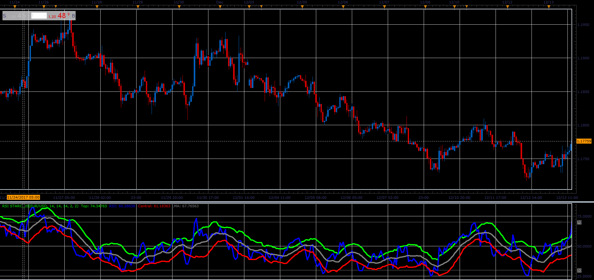

# RSI STARC

> Source: https://fxcodebase.com/code/viewtopic.php?f=48&t=65578  
> Forum: 48 · Topic 65578 · 3 post(s)

---

## RSI STARC

**Alexander.Gettinger** · Sat Jan 06, 2018 5:38 pm

Formulas:
RSI = Relative Strength Index(Close price, RSI_Length),
MA = MVA(RSI, MA_Length),
Top = MA+Top_Multiplier*ATR,
Central = MA-Bottom_Multiplier*ATR, where
ATR = MVA(TR, ATR_Length),
TR[i] = Abs(RSI[i]-RSI[i-1]),
Abs - Absolute value.

 

Download:

 [RSI STARC_JS.jsl](files/116857/RSI%20STARC_JS.jsl)

MT4/MQ4 version
[viewtopic.php?f=38&t=60797](https://fxcodebase.com/code/viewtopic.php?f=38&t=60797)

---

## Re: RSI STARC

**James.Ma** · Tue Jan 01, 2019 10:47 pm

Can you provide MQL4 version?
Thank you

---

## Re: RSI STARC

**Apprentice** · Wed Jan 02, 2019 6:08 am

MT4/MQ4 version
[viewtopic.php?f=38&t=60797](https://fxcodebase.com/code/viewtopic.php?f=38&t=60797)
