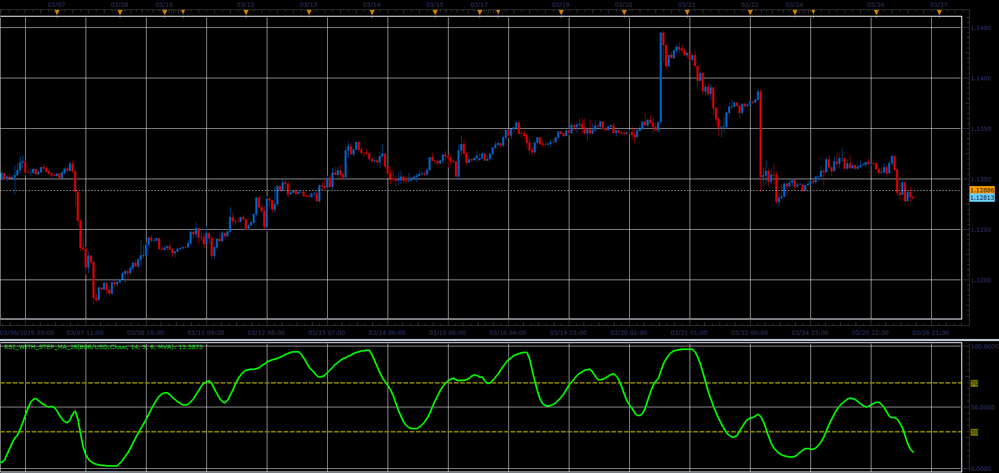

# RSI with step MA oscillator

> Source: https://fxcodebase.com/code/viewtopic.php?f=48&t=68242  
> Forum: 48 · Topic 68242 · 1 post(s)

---

## RSI with step MA oscillator

**Alexander.Gettinger** · Sat Mar 30, 2019 2:48 pm

Formulas:
RSI[i] = 100-(100/(1+Positive/Negative)), where
Positive, Negative - sum of positive and negative changes of Diff,
Diff[i] = MA[i]-MA[i-Step].

 

Download:

 [RSI_With_Step_MA_JS.jsl](files/125462/RSI_With_Step_MA_JS.jsl)

For this indicator must be installed Averages indicator ([viewtopic.php?f=17&t=2430](https://fxcodebase.com/code/viewtopic.php?f=17&t=2430)).
