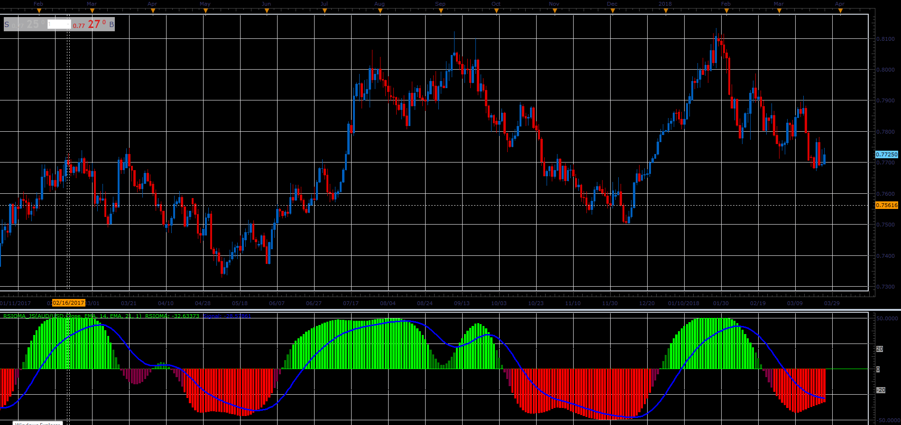

# RSIOMA oscillator

> Source: https://fxcodebase.com/code/viewtopic.php?f=48&t=66019  
> Forum: 48 · Topic 66019 · 1 post(s)

---

## RSIOMA oscillator

**Alexander.Gettinger** · Tue May 01, 2018 1:43 pm

Formulas:
RSIOMA = 50 - 100/res, where
res = 1+p/n,
p, n - sum of positive and negative changes of Momentum.
Signal - moving average of RSIOMA.

 

Download:

 [RSIOMA_JS.jsl](files/118945/RSIOMA_JS.jsl)

For this oscillator must be installed Averages indicator ([viewtopic.php?f=17&t=2430](https://fxcodebase.com/code/viewtopic.php?f=17&t=2430)).
