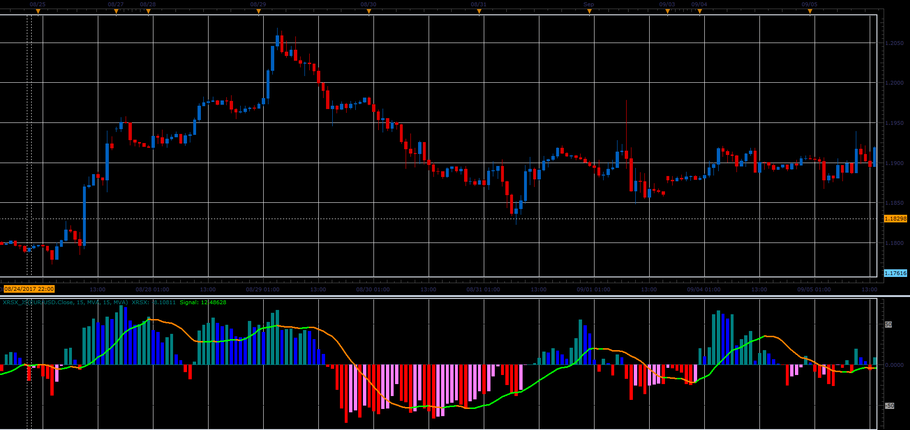

# RSX indicator

> Source: https://fxcodebase.com/code/viewtopic.php?f=48&t=65311  
> Forum: 48 · Topic 65311 · 1 post(s)

---

## RSX indicator

**Alexander.Gettinger** · Sat Oct 28, 2017 2:53 pm

Formulas:
RSX=(DMA/AbsDMA)*50+50, where
DMA-moving average for DPrice,
AbsDMA-moving average for AbsDPrice,
DPrice[i]=Price[i]-Price[i-1],
AbsDPrice[i]=Abs(Price[i]-Price[i-1]).

 

Download:

 [XRSX_JS.jsl](files/115736/XRSX_JS.jsl)
