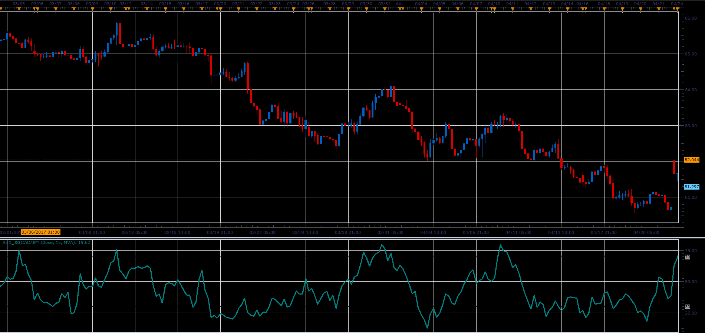
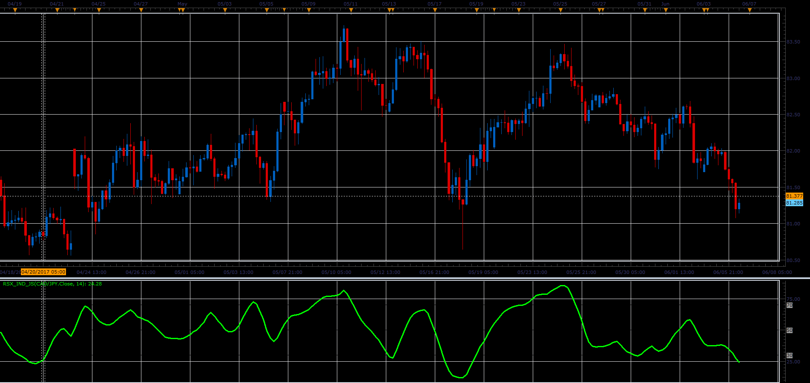
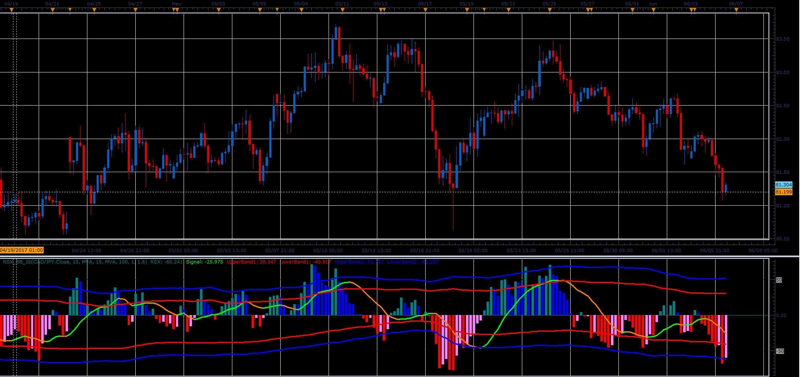
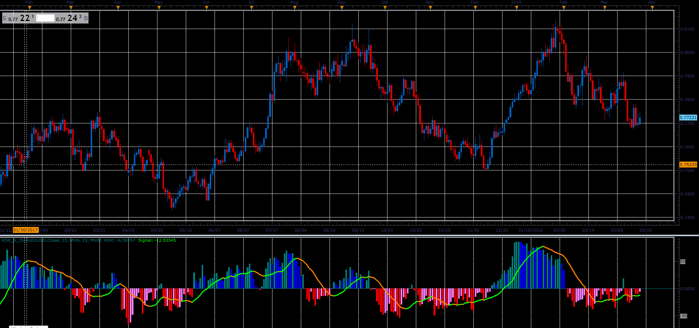

# RSX indicators

> Source: https://fxcodebase.com/code/viewtopic.php?f=48&t=64833  
> Forum: 48 · Topic 64833 · 2 post(s)

---

## RSX indicators

**Alexander.Gettinger** · Fri Jun 23, 2017 2:56 pm

Formulas:
RSX=(DMA/AbsDMA)*50+50, where
DMA-moving average for DPrice,
AbsDMA-moving average for AbsDPrice,
DPrice[i]=Price[i]-Price[i-1],
AbsDPrice[i]=Abs(Price[i]-Price[i-1]).

RSX_BB - indicator with signal line and bands.

**RSX:**

 

Download:

 [RSX_JS.jsl](files/113090/RSX_JS.jsl)

**RSX indicator:**

 

Download:

 [RSX_Ind_JS.jsl](files/113090/RSX_Ind_JS.jsl)

**RSX_BB:**

 

Download:

 [RSX_BB_JS.jsl](files/113090/RSX_BB_JS.jsl)

---

## Re: RSX indicators

**Alexander.Gettinger** · Tue May 01, 2018 1:44 pm

**RSX_S:**

 

Download:

 [RSX_S_JS.jsl](files/118946/RSX_S_JS.jsl)
