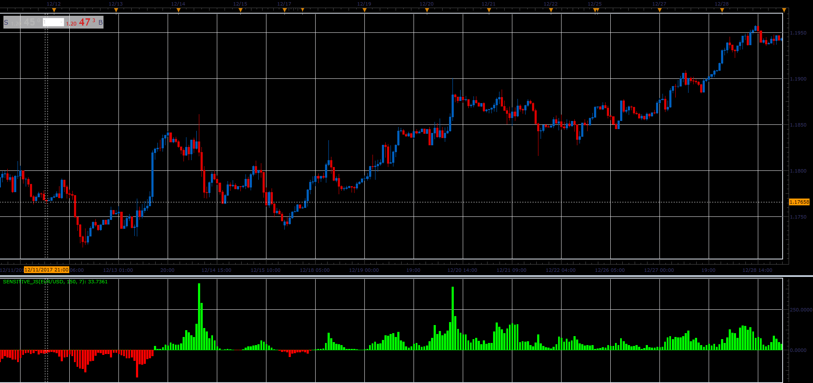

# Sensitive oscillator

> Source: https://fxcodebase.com/code/viewtopic.php?f=48&t=65582  
> Forum: 48 · Topic 65582 · 1 post(s)

---

## Sensitive oscillator

**Alexander.Gettinger** · Sat Jan 06, 2018 5:44 pm

Formulas:
Sensitive[i]=(5*MAclose-5*MAopen+max+min-MAhigh-MAlow)*Volume, where
MAclose, MAopen, MAhigh, MAlow - moving averages (with [Period] period) of close, open, high and low prices,
max, min - maximum and minimum prices at range from (i-Sensitive) to (i).

 

Download:

 [Sensitive_JS.jsl](files/116861/Sensitive_JS.jsl)
