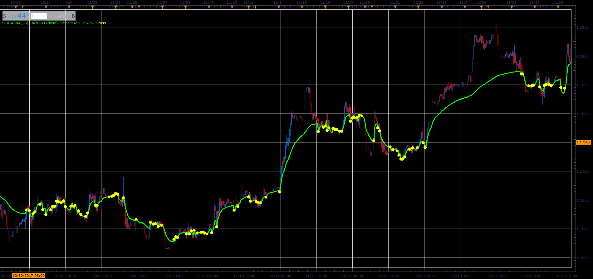

# Serial moving average

> Source: https://fxcodebase.com/code/viewtopic.php?f=48&t=65583  
> Forum: 48 · Topic 65583 · 1 post(s)

---

## Serial moving average

**Alexander.Gettinger** · Sat Jan 06, 2018 5:45 pm

Simple moving average with a variable (increasing) period.
The period resets in the points of intersection of price and MA.

 

Download:

 [SerialMA_JS.jsl](files/116862/SerialMA_JS.jsl)
