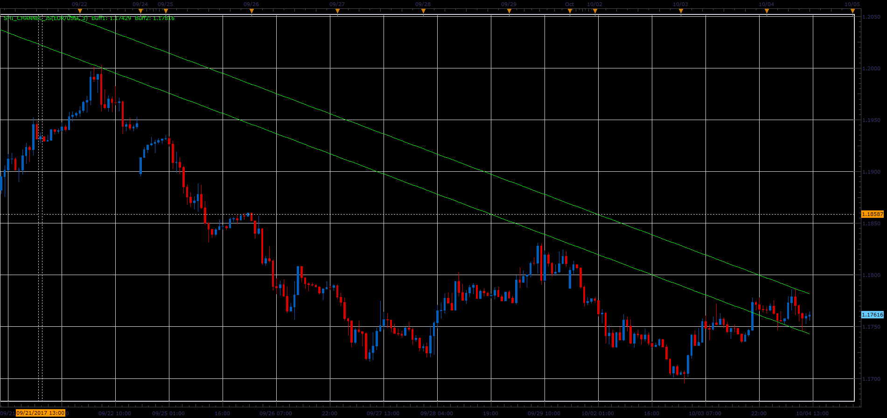

# SHI Channel indicator

> Source: https://fxcodebase.com/code/viewtopic.php?f=48&t=65260  
> Forum: 48 · Topic 65260 · 1 post(s)

---

## SHI Channel indicator

**Alexander.Gettinger** · Sat Oct 28, 2017 11:39 am

The indicator finds last and previous fractals and draw draws line through them. Parallel line draws on opposite side on last fractal.

 

Download:

 [SHI_Channel_JS.jsl](files/115685/SHI_Channel_JS.jsl)
