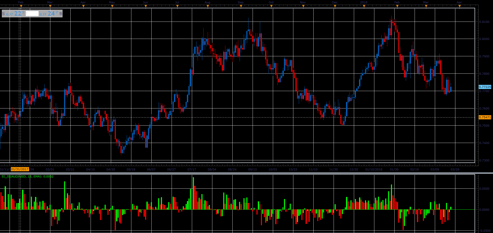

# SI oscillator

> Source: https://fxcodebase.com/code/viewtopic.php?f=48&t=66020  
> Forum: 48 · Topic 66020 · 1 post(s)

---

## SI oscillator

**Alexander.Gettinger** · Tue May 01, 2018 1:45 pm

Formulas:
SI = MA(D), where
D = 50*X*K/R,
X[i] = 0.25*Open[i]-1.5*Close[i-1]+0.75*Close[i]+0.5*Open[i-1],
R = R1-R2/2+R4/4, if R1>=Max(R2, R3),
R = R2-R1/2+R4/4, if R2>=Max(R1, R3),
R = R3+R4/4, in other cases,
K = Max(R1, R2),
R1[i] = Abs(High[i]-Close[i-1]),
R2[i] = Abs(Low[i]-Close[i-1]),
R3[i] = Abs(High[i]-Low[i]),
R4[i] = Abs(Close[i-1]-Open[i-1]).

 

Download:

 [SI_JS.jsl](files/118947/SI_JS.jsl)

For this indicator must be installed Averages indicator ([viewtopic.php?f=17&t=2430](https://fxcodebase.com/code/viewtopic.php?f=17&t=2430)).
