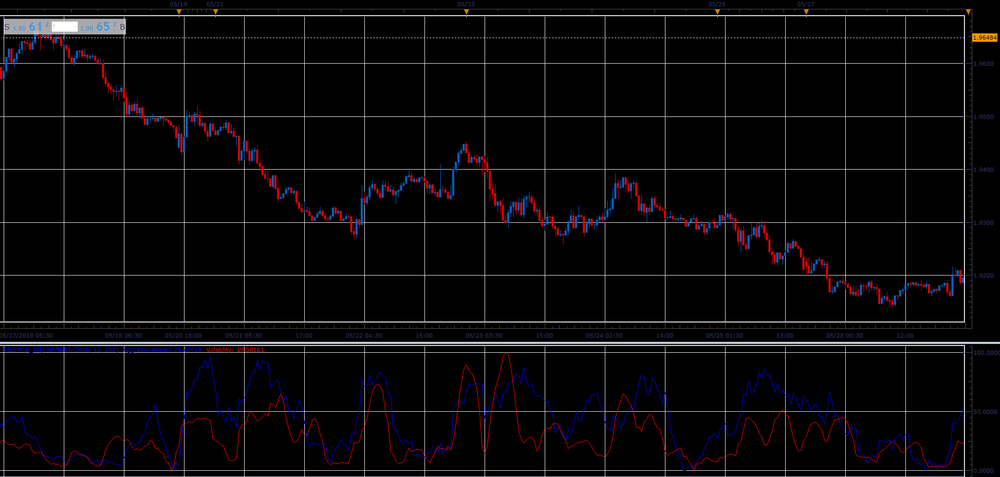

# Silence oscillator

> Source: https://fxcodebase.com/code/viewtopic.php?f=48&t=66558  
> Forum: 48 · Topic 66558 · 1 post(s)

---

## Silence oscillator

**Alexander.Gettinger** · Sun Aug 19, 2018 1:59 pm

Indicator show aggressiveness (velocity of price change, blue line) and volatility (red line).
Volatility corresponds to StdDev indicator.

 

Download:

 [Silence_JS.jsl](files/120665/Silence_JS.jsl)
