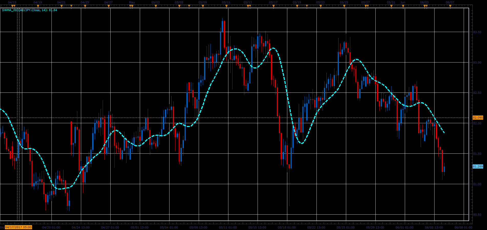

# Sine Weighted Moving Average

> Source: https://fxcodebase.com/code/viewtopic.php?f=48&t=64853  
> Forum: 48 · Topic 64853 · 1 post(s)

---

## Sine Weighted Moving Average

**Alexander.Gettinger** · Wed Jun 28, 2017 12:02 pm

Formula:
SineWMA[i]=Sum/Weight, where
Sum=Price[i-N+1]*sin(PI*(N)/(N+1))+Price[i-N+2]*sin(PI*(N-1)/(N+1))+…+Price[i]*sin(PI*1/(N+1))
Weight= sin(PI*(N)/(N+1))+ sin(PI*(N-1)/(N+1))+…+ sin(PI*1/(N+1)).

 

Download:

 [SWMA_JS.jsl](files/113245/SWMA_JS.jsl)
