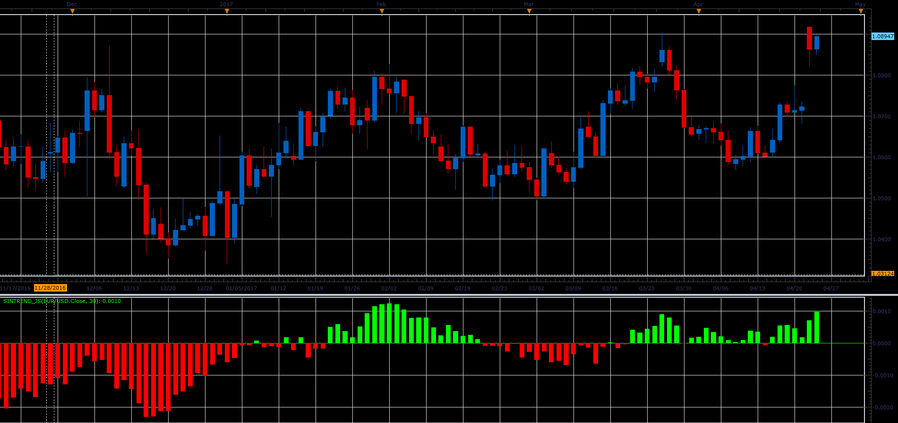

# SinTrend indicator

> Source: https://fxcodebase.com/code/viewtopic.php?f=48&t=64742  
> Forum: 48 · Topic 64742 · 1 post(s)

---

## SinTrend indicator

**Alexander.Gettinger** · Mon Jun 05, 2017 11:21 am

Formula:
SinTrend[i]=Sin((Price[i]-Price[i-Period])/Period).

 

Download:

 [SinTrend_JS.jsl](files/112753/SinTrend_JS.jsl)
