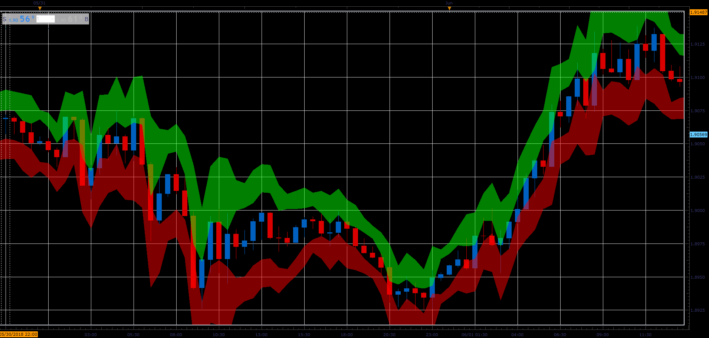

# SL ATR indicator

> Source: https://fxcodebase.com/code/viewtopic.php?f=48&t=66560  
> Forum: 48 · Topic 66560 · 1 post(s)

---

## SL ATR indicator

**Alexander.Gettinger** · Sun Aug 19, 2018 1:59 pm

Formulas:
Upper band (High+K*ATR, Low+K*ATR),
Lower band (High-K*ATR, Low-K*ATR).

 

Download:

 [SL_ATR_JS.jsl](files/120667/SL_ATR_JS.jsl)
