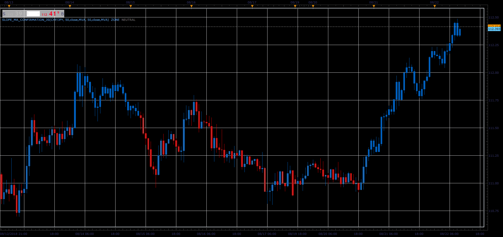

# Slope/MA Confirmation Indicator

> Source: https://fxcodebase.com/code/viewtopic.php?f=48&t=66990  
> Forum: 48 · Topic 66990 · 1 post(s)

---

## Slope/MA Confirmation Indicator

**Alexander.Gettinger** · Sat Nov 24, 2018 5:19 pm

The indicator shows when the SDL and MA are in harmony.

 

Download:

 [Slope_MA_Confirmation_JS.jsl](files/122319/Slope_MA_Confirmation_JS.jsl)

For this indicator must be installed Slope direction line ([viewtopic.php?f=17&t=949&p=1738#p1738](https://fxcodebase.com/code/viewtopic.php?f=17&t=949&p=1738#p1738)).
