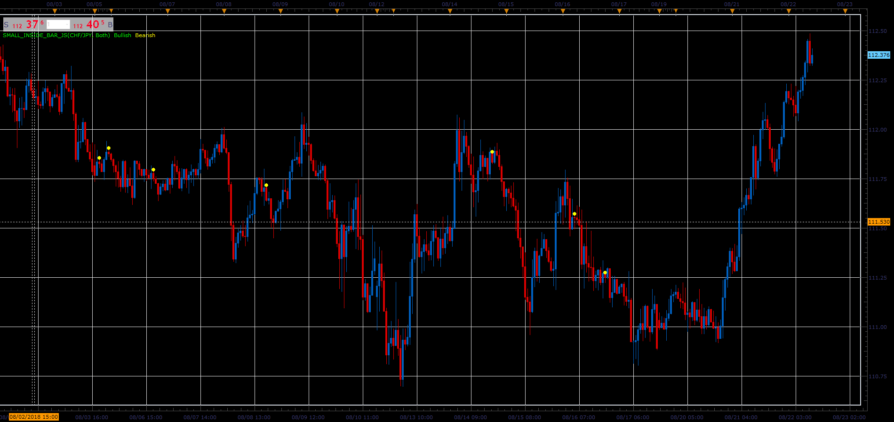

# Small inside bar

> Source: https://fxcodebase.com/code/viewtopic.php?f=48&t=66991  
> Forum: 48 · Topic 66991 · 1 post(s)

---

## Small inside bar

**Alexander.Gettinger** · Sat Nov 24, 2018 5:21 pm

Bullish small inside bar conditions:
1. High[i]<High[i-1],
2. Low[i]>Low[i-1],
3. (High[i-1]-Low[i-1])/(High[i]-Low[i]) >2,
4. Close[i]>Open[i],
5. High[i]<Median[i-1],
6. Close[i-1]<Open[i-1].

Bearish small inside bar conditions:
1. High[i]<High[i-1],
2. Low[i]>Low[i-1],
3. (High[i-1]-Low[i-1])/(High[i]-Low[i]) >2,
4. Close[i]<Open[i],
5. Low[i]<Median[i-1],
6. Close[i-1]>Open[i-1].

 

Download:

 [Small_Inside_Bar_JS.jsl](files/122320/Small_Inside_Bar_JS.jsl)
