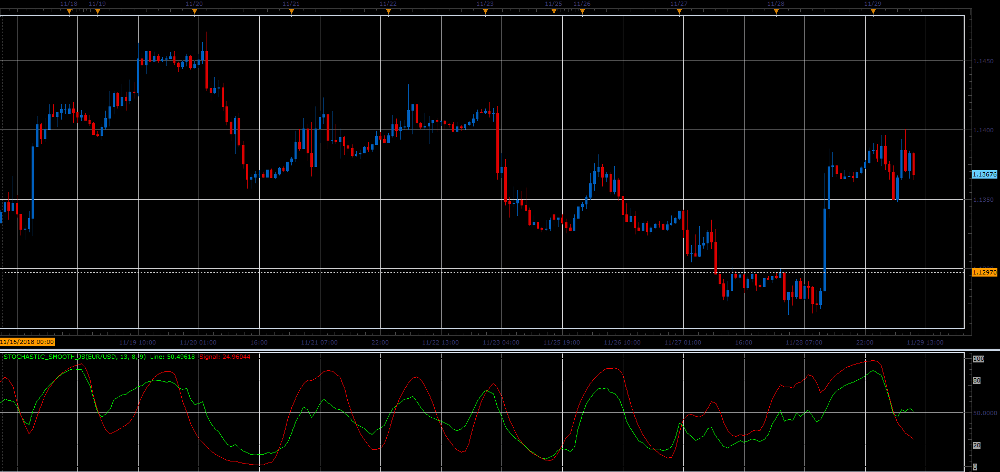

# Smooth stochastic indicator

> Source: https://fxcodebase.com/code/viewtopic.php?f=48&t=67112  
> Forum: 48 · Topic 67112 · 1 post(s)

---

## Smooth stochastic indicator

**Alexander.Gettinger** · Fri Dec 07, 2018 3:11 pm

The indicator looks like traditional stochastic.

Formulas:
Line[i]=K*(St-Line[i-1])+Line[i-1],
Signal[i]=K2*(St2-Signal[i-1])+Signal[i-1], where
K=2/(1+[Slowing]),
K2=2/(1+[SignalSlowing]),
St=100*(close[i]-LowPrice)/(HighPrice-LowPrice),
LowPrice and HighPrice is a minimum and maximum prices at range from i-Period to i,
S2=100*(Line[i]-LowPrice2)/(HighPrice2-LowPrice2),
LowPrice2 and HighPrice2 is a minimum and maximum of Line at range from i-Period to i.

 

Download:

 [Stochastic_Smooth_JS.jsl](files/122623/Stochastic_Smooth_JS.jsl)
