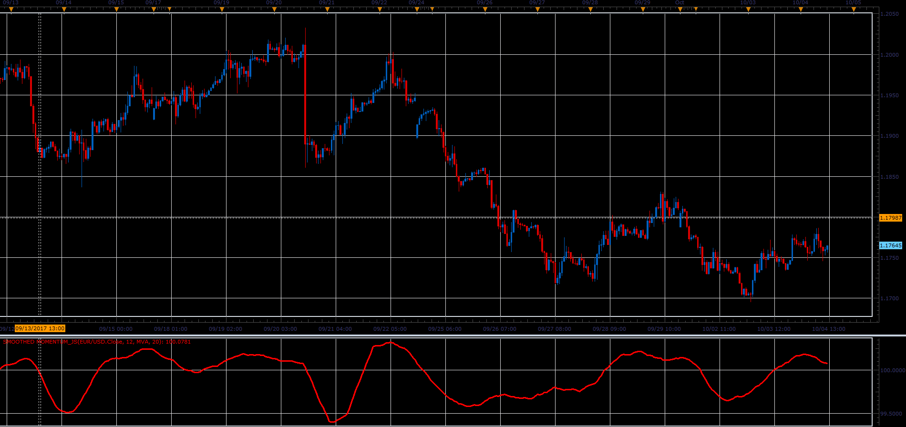

# Smoothed Momentum

> Source: https://fxcodebase.com/code/viewtopic.php?f=48&t=65266  
> Forum: 48 · Topic 65266 · 3 post(s)

---

## Smoothed Momentum

**Alexander.Gettinger** · Sat Oct 28, 2017 11:46 am

Download:

 [Smoothed Momentum_JS.jsl](files/115691/Smoothed%20Momentum_JS.jsl)

---

## Re: Smoothed Momentum

**xristos1982** · Fri May 31, 2024 2:30 pm

Can i have this in lua please?

---

## Re: Smoothed Momentum

**Apprentice** · Sun Jun 02, 2024 2:27 pm

Try this version.
[https://fxcodebase.com/code/viewtopic.php?f=17&t=62770](https://fxcodebase.com/code/viewtopic.php?f=17&t=62770)
