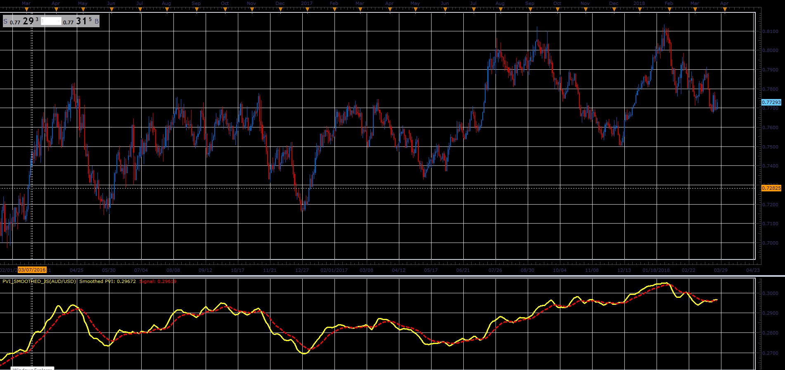

# Smoothed Positive Volume Index

> Source: https://fxcodebase.com/code/viewtopic.php?f=48&t=66071  
> Forum: 48 · Topic 66071 · 1 post(s)

---

## Smoothed Positive Volume Index

**Alexander.Gettinger** · Wed May 02, 2018 12:21 pm

Formulas:
Smoothed PVI = MVA(PVI, Smooth period),
Signal = EMA(Smoothed PVI, Signal period), where
PVI - Positive Volume Index.

 

Download:

 [PVI_Smoothed_JS.jsl](files/119023/PVI_Smoothed_JS.jsl)
