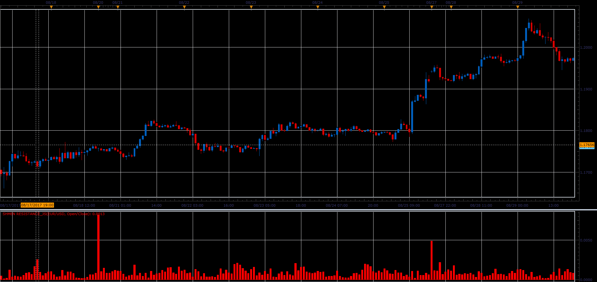

# Smoothed Shmen Resistance

> Source: https://fxcodebase.com/code/viewtopic.php?f=48&t=65261  
> Forum: 48 · Topic 65261 · 1 post(s)

---

## Smoothed Shmen Resistance

**Alexander.Gettinger** · Sat Oct 28, 2017 11:41 am

Formulas:
SR = Diff/Vol, if not inverse,
SR = Vol/Diff, if inverse,
Vol = Max(Volume, MinVolume),
Diff = Max(RVR, MinPips),
RVR - Range Volume Ratio,
Signal = Moving average(SR, MA_Length, MA_Method).

 

Download:

 [Shmen Resistance_JS.jsl](files/115686/Shmen%20Resistance_JS.jsl)
