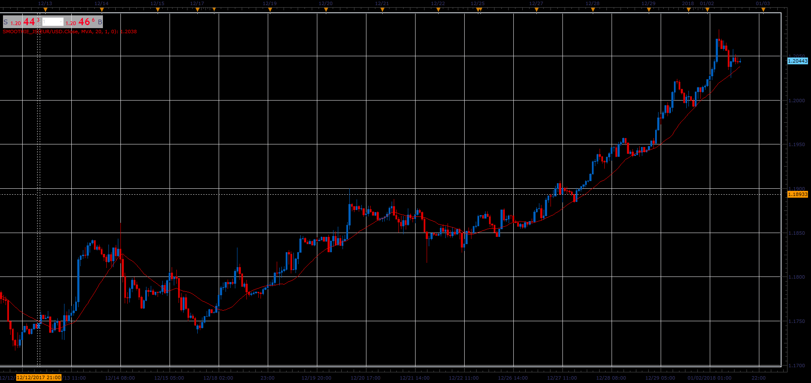

# Smoothie indicator

> Source: https://fxcodebase.com/code/viewtopic.php?f=48&t=65587  
> Forum: 48 · Topic 65587 · 1 post(s)

---

## Smoothie indicator

**Alexander.Gettinger** · Sat Jan 06, 2018 5:52 pm

If Number of repetitions parameter is set to 1, The indicator is behaving like a regular moving average.
If Number of repetitions parameter is not 1, The indicator is result of continuous smoothing
For example MVA of MVA of MVA...

 

Download:

 [Smoothie_JS.jsl](files/116866/Smoothie_JS.jsl)
