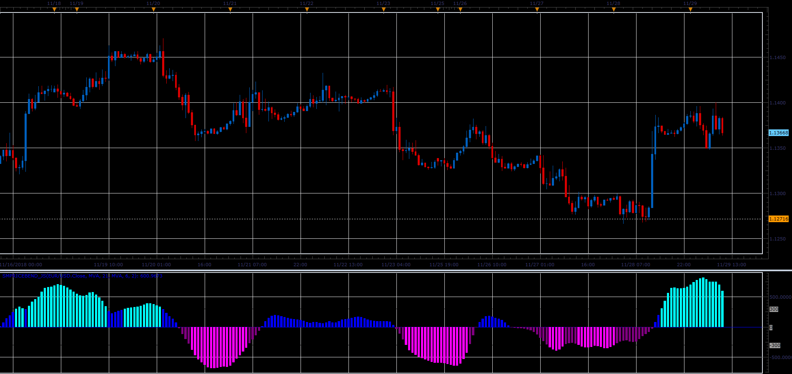

# SmPriceBend oscillator

> Source: https://fxcodebase.com/code/viewtopic.php?f=48&t=67109  
> Forum: 48 · Topic 67109 · 1 post(s)

---

## SmPriceBend oscillator

**Alexander.Gettinger** · Fri Dec 07, 2018 3:06 pm

Formulas:
SmPriceBend = MA2(Momentum(MA1)), where
MA1 - moving average with [Method1] and [Period1] from price,
MA2 - moving average with [Method2] and [Period2] from Momentum.

 

Download:

 [SmPriceBend_JS.jsl](files/122620/SmPriceBend_JS.jsl)

For this indicator must be installed Averages indicator ([viewtopic.php?f=17&t=2430](https://fxcodebase.com/code/viewtopic.php?f=17&t=2430)).
