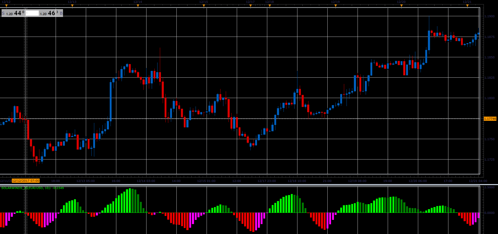

# Solar Winds oscillator

> Source: https://fxcodebase.com/code/viewtopic.php?f=48&t=65589  
> Forum: 48 · Topic 65589 · 5 post(s)

---

## Solar Winds oscillator

**Alexander.Gettinger** · Sat Jan 06, 2018 6:18 pm

Formulas:
SW[i]=(ln((1+Value[i])/(1-Value[i]))+SW[i-1])/2, where
ln - natural logarithm,
Value[i]=(((Median price[i] - MinP)/(MaxP-MinP)-0.5)+Value[i-1])*2/3,
MinP, MaxP - minimum and maximum prices in the range from (i-Period) to i.

 

Download:

 [SolarWinds_JS.jsl](files/116868/SolarWinds_JS.jsl)

MT4/MQ4 version.
[viewtopic.php?f=38&t=68169](https://fxcodebase.com/code/viewtopic.php?f=38&t=68169)

---

## Re: Solar Winds oscillator

**blazerodheineken** · Tue Jul 31, 2018 9:11 am

I knew that it can be solar power, solar energy, but what is Solar Winds oscillator??

---

## Re: Solar Winds oscillator

**Apprentice** · Thu Aug 09, 2018 11:49 am

All I know about this indicator is above formula.

---

## Re: Solar Winds oscillator

**oxbx99** · Fri Mar 22, 2019 2:40 pm

please make mq4 version for the same formula above.

---

## Re: Solar Winds oscillator

**Apprentice** · Mon Mar 25, 2019 9:46 am

MT4/MQ4 version.
[viewtopic.php?f=38&t=68169](https://fxcodebase.com/code/viewtopic.php?f=38&t=68169)
