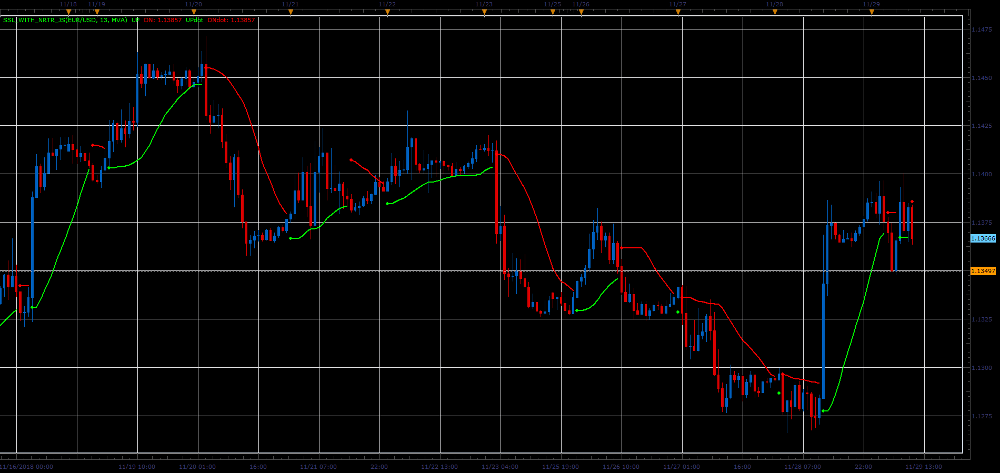

# SSL with NRTR indicator

> Source: https://fxcodebase.com/code/viewtopic.php?f=48&t=67110  
> Forum: 48 · Topic 67110 · 1 post(s)

---

## SSL with NRTR indicator

**Alexander.Gettinger** · Fri Dec 07, 2018 3:09 pm

Original LUA indicator: [viewtopic.php?f=17&t=41294](https://fxcodebase.com/code/viewtopic.php?f=17&t=41294)

 

Download:

 [SSL_with_NRTR_JS.jsl](files/122621/SSL_with_NRTR_JS.jsl)

For this indicator must be installed Averages indicator ([viewtopic.php?f=17&t=2430](https://fxcodebase.com/code/viewtopic.php?f=17&t=2430)).
