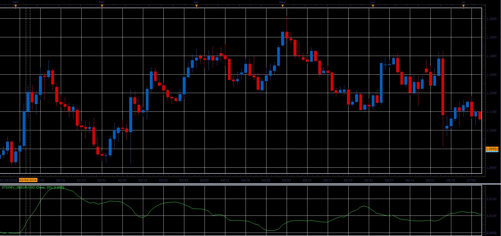

# Standard Deviation Indicator

> Source: https://fxcodebase.com/code/viewtopic.php?f=48&t=64743  
> Forum: 48 · Topic 64743 · 1 post(s)

---

## Standard Deviation Indicator

**Alexander.Gettinger** · Mon Jun 05, 2017 11:23 am

Formula:
StdDev (i) = SQRT (AMOUNT (j = i - N, i) / N)
AMOUNT (j = i - N, i) = SUM ((ApPRICE (j) - MA (ApPRICE (i), N, i)) ^ 2)
Where:
StdDev (i) — Standard Deviation of the current bar;
SQRT — square root;
AMOUNT(j = i - N, i) — sum of squares from j = i - N to i;
N — smoothing period;
ApPRICE (j) — the price of the j-th bar;
MA (ApPRICE (i), N, i) — moving average of the current bar for N periods;
ApPRICE (i) — the price of the current bar.

 

Download:

 [StdDev_JS.jsl](files/112754/StdDev_JS.jsl)
