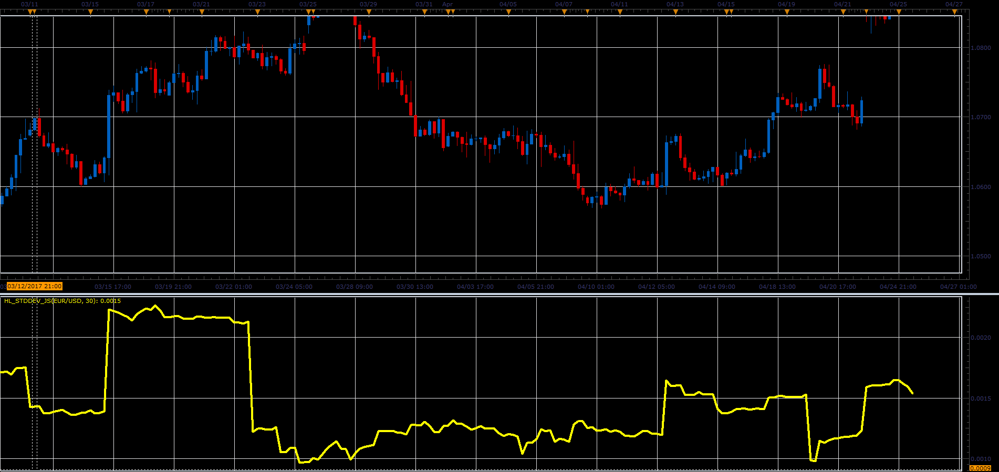

# Standard deviation of High/Low

> Source: https://fxcodebase.com/code/viewtopic.php?f=48&t=64721  
> Forum: 48 · Topic 64721 · 1 post(s)

---

## Standard deviation of High/Low

**Alexander.Gettinger** · Fri Jun 02, 2017 2:02 pm

Formula:
HL_StdDev = Standard Deviation (HL), where
HL = High-Low.

 

Download:

 [HL_StdDev_JS.jsl](files/112710/HL_StdDev_JS.jsl)
