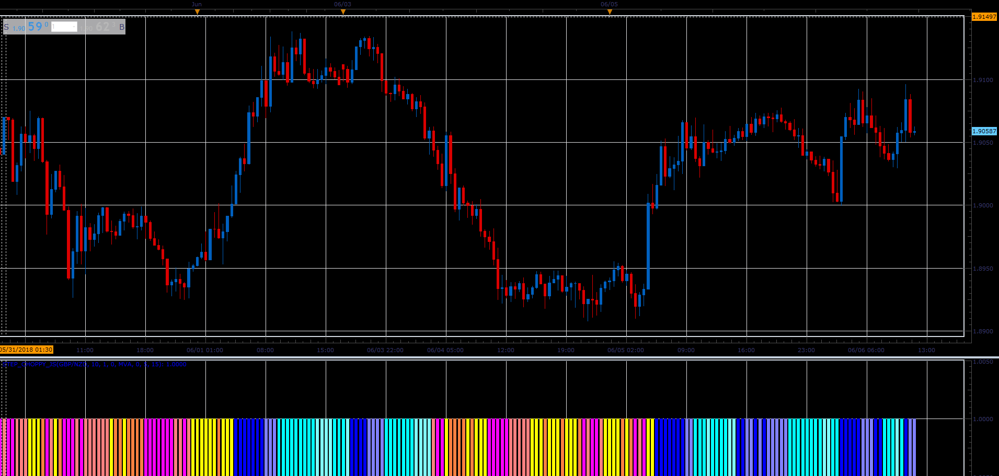

# Step choppy oscillator

> Source: https://fxcodebase.com/code/viewtopic.php?f=48&t=66562  
> Forum: 48 · Topic 66562 · 1 post(s)

---

## Step choppy oscillator

**Alexander.Gettinger** · Sun Aug 19, 2018 1:59 pm

Download:

 [Step_Choppy_JS.jsl](files/120669/Step_Choppy_JS.jsl)

This indicator must be installed for Step_MA ([viewtopic.php?f=17&t=59995](https://fxcodebase.com/code/viewtopic.php?f=17&t=59995)), Step_RSI2 ([viewtopic.php?f=17&t=59996](https://fxcodebase.com/code/viewtopic.php?f=17&t=59996)), and Averages([viewtopic.php?f=17&t=2430](https://fxcodebase.com/code/viewtopic.php?f=17&t=2430)) indicators.
