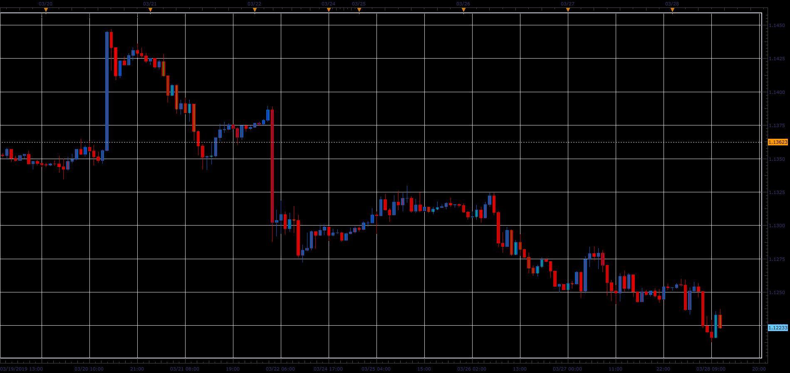

# Stochastic color candle

> Source: https://fxcodebase.com/code/viewtopic.php?f=48&t=68278  
> Forum: 48 · Topic 68278 · 1 post(s)

---

## Stochastic color candle

**Alexander.Gettinger** · Sat Mar 30, 2019 4:03 pm

The indicator paints candle in correspondence to Stochastic values.
If Stochastic<[Level1] candle have a [Color1],
if Stochastic>[Level1] and <[Level2] candle have a [Color2] and
if Stochastic>[Level2] candle have a [Color3].

 

Download:

 [Stochastic_Color_Candle_JS.jsl](files/125498/Stochastic_Color_Candle_JS.jsl)
