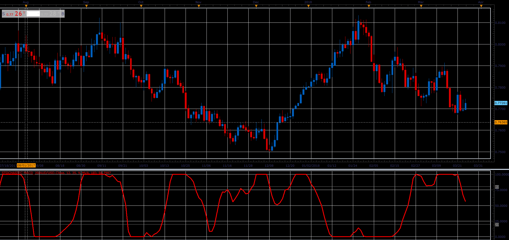

# Stochastic MACD

> Source: https://fxcodebase.com/code/viewtopic.php?f=48&t=66029  
> Forum: 48 · Topic 66029 · 1 post(s)

---

## Stochastic MACD

**Alexander.Gettinger** · Tue May 01, 2018 2:32 pm

Formulas:
Stochastic MACD[i] = 100*(B1[i]-MA[i]-Min)/(Max-Min), where
B1[i] = MA(Short_Length, Method, Price, i)-MA(Long_Length, Method, Price, i),
MA[i] = Moving average(B1, Signal_Length, Method, i),
Min, Max - minimum and maximum B2 at range from (i-Stochastic_Length) to i,
B2[i] = B1[i]-MA[i].

 

Download:

 [Stochastic MACD_JS.jsl](files/118957/Stochastic%20MACD_JS.jsl)
