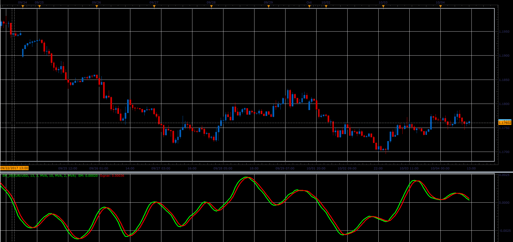

# Stochastic momentum oscillator

> Source: https://fxcodebase.com/code/viewtopic.php?f=48&t=65264  
> Forum: 48 · Topic 65264 · 1 post(s)

---

## Stochastic momentum oscillator

**Alexander.Gettinger** · Sat Oct 28, 2017 11:44 am

As described in the 1993, January issue of S & C Magazine.
Two in one indicator.
If smoothing is applied, it is average stochastic momentum (ASM)
if not, it is the Stochastic Momentum (SM).

 

Download:

 [SM_JS.jsl](files/115689/SM_JS.jsl)
