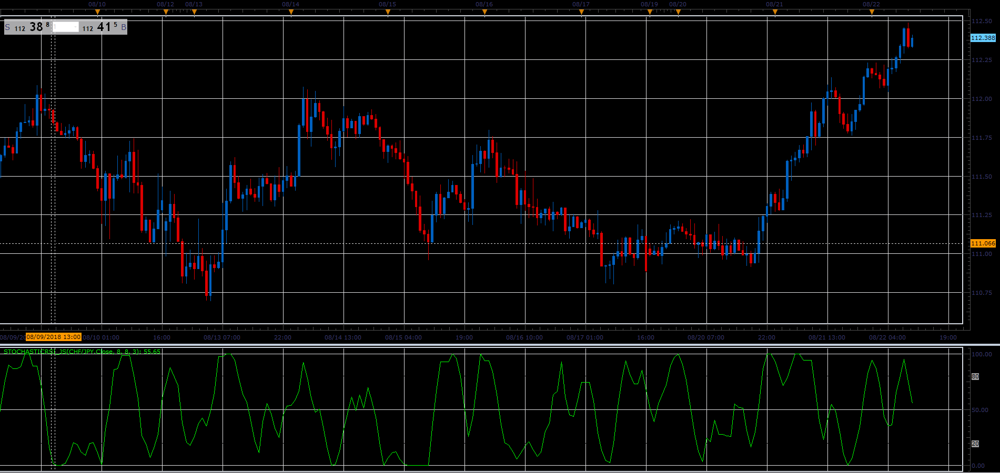

# Stochastic RSI

> Source: https://fxcodebase.com/code/viewtopic.php?f=48&t=66996  
> Forum: 48 · Topic 66996 · 1 post(s)

---

## Stochastic RSI

**Alexander.Gettinger** · Sat Nov 24, 2018 5:31 pm

The indicator was introduced by by Tuschar Chande and Stanley Kroll in December, 1992 Stocks and Commodities' article and combines two indicators RSI and Stochastic.

Formula:
LR = Lowest RSI(PRICE, N) for K periods
HR = Highest RSI(PRICE, N) for K periods
FAST = MVA((RSI(PRICE, N)[now] - LR) / (HR - LR) * 100), SK)
SLOW = MVA(FAST, D)

 

Download:

 [StochasticRSI_JS.jsl](files/122325/StochasticRSI_JS.jsl)
