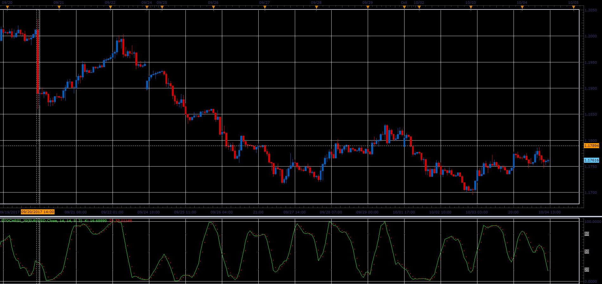

# Stochastic RSI

> Source: https://fxcodebase.com/code/viewtopic.php?f=48&t=65272  
> Forum: 48 · Topic 65272 · 1 post(s)

---

## Stochastic RSI

**Alexander.Gettinger** · Sat Oct 28, 2017 11:57 am

The indicator was introduced by by Tuschar Chande and Stanley Kroll in December, 1992 Stocks and Commodities' article and combines two indicators RSI and Stochastic.

The Stochastic RSI Oscillator is a momentum indicator which shows the relation of the current RSI value relative to its high/low range over a given number of periods.

The indicator has four parameters:
N - the number of periods for RSI calculation
K - the number of periods to calculate the stochastic fast line
SK - the number of periods to smooth the stochastic fast line (use 1 to do not smooth the fast line)
D - the number of periods to calculate the stochastic slow line

The formula is:
LR = Lowest RSI(PRICE, N) for K periods
HR = Highest RSI(PRICE, N) for K periods
FAST = MVA((RSI(PRICE, N)[now] - LR) / (HR - LR) * 100), SK)
SLOW = MVA(FAST, D)

 

Download:

 [StochRSI_JS.jsl](files/115697/StochRSI_JS.jsl)
