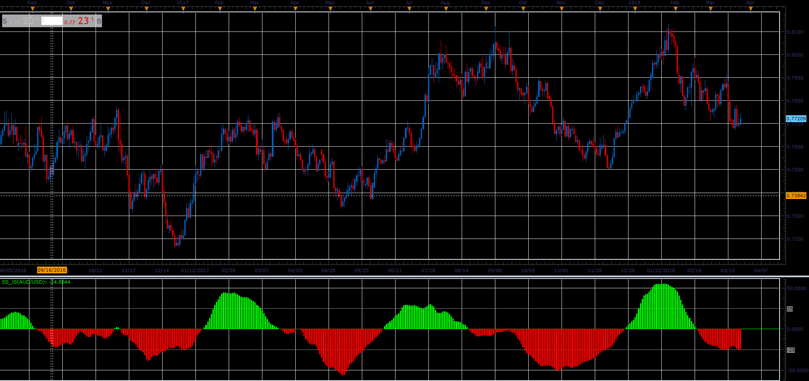

# Stochastic Stack oscillator

> Source: https://fxcodebase.com/code/viewtopic.php?f=48&t=66025  
> Forum: 48 · Topic 66025 · 1 post(s)

---

## Stochastic Stack oscillator

**Alexander.Gettinger** · Tue May 01, 2018 1:57 pm

SS = ( STO1-STO2) + ( STO3-STO4) + ( STO5-STO6) + ( STO7-STO8)

 

Download:

 [SS_JS.jsl](files/118953/SS_JS.jsl)
