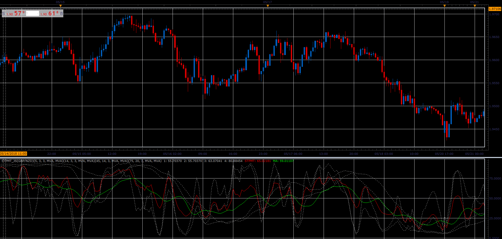

# STPMT

> Source: https://fxcodebase.com/code/viewtopic.php?f=48&t=66564  
> Forum: 48 · Topic 66564 · 1 post(s)

---

## STPMT

**Alexander.Gettinger** · Sun Aug 19, 2018 2:02 pm

The indicator is calculated by the formula
STPMT = [4.1*sto(5,3,3) + 2.5*sto(14,3,3) + sto(45,14,3) + 4*sto(75,20,3)] / 11.6

In addition to the indicator, the indicator shows the moving average of it and individual components.

 

Download:

 [STPMT_JS.jsl](files/120671/STPMT_JS.jsl)
