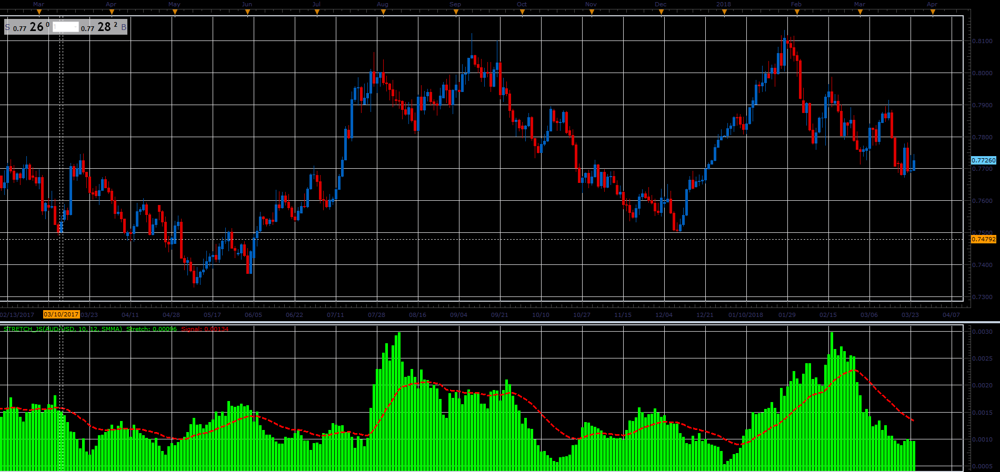
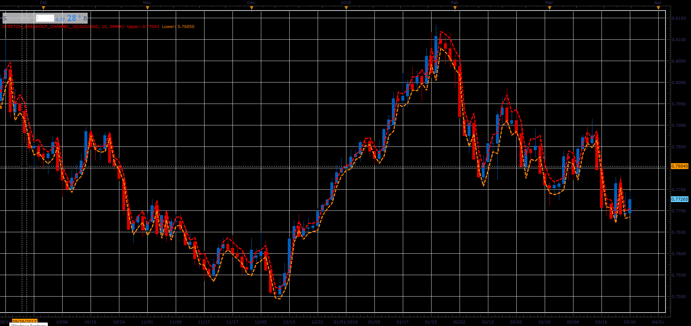

# Stretch Breakout Channel

> Source: https://fxcodebase.com/code/viewtopic.php?f=48&t=66030  
> Forum: 48 · Topic 66030 · 1 post(s)

---

## Stretch Breakout Channel

**Alexander.Gettinger** · Tue May 01, 2018 2:35 pm

The indicators are based on free MT4 indicators made by Arturo López, founder of Point Zero Trading Solutions and are based on ideas of Toby Crabel, the author of Day Trading with Short-term Price Patterns.

**Stretch oscillator:**

 

Download:

 [Stretch_JS.jsl](files/118958/Stretch_JS.jsl)

**Stretch breakout channel:**

 

Download:

 [Stretch_Breakout_Channel_JS.jsl](files/118958/Stretch_Breakout_Channel_JS.jsl)

For this indicators must be installed Averages indicator ([viewtopic.php?f=17&t=2430](https://fxcodebase.com/code/viewtopic.php?f=17&t=2430)).
