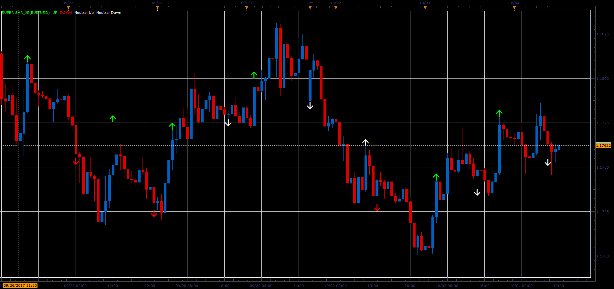

# Super SAR

> Source: https://fxcodebase.com/code/viewtopic.php?f=48&t=65274  
> Forum: 48 · Topic 65274 · 1 post(s)

---

## Super SAR

**Alexander.Gettinger** · Sat Oct 28, 2017 12:02 pm

Green / Red Arrows (enter the trade) are generated after the change of SAR indication, only if it is confirmed by SuperTrend indicators.

White Arrows (miss the trade) are generated after the change of SAR indication, only if it is not confirmed by SuperTrend indicators.

If you use wider definition options, the Arrows is generated when both conditions are positive, regardless of the sequence of positive indications.

 

Download:

 [Super SAR_JS.jsl](files/115699/Super%20SAR_JS.jsl)
