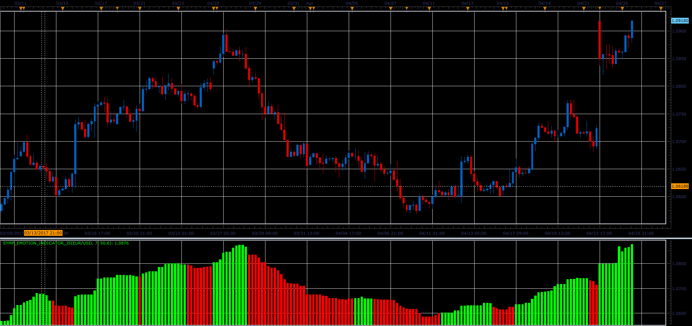

# Symphonie Emotion indicator

> Source: https://fxcodebase.com/code/viewtopic.php?f=48&t=64744  
> Forum: 48 · Topic 64744 · 1 post(s)

---

## Symphonie Emotion indicator

**Alexander.Gettinger** · Mon Jun 05, 2017 11:26 am

Formula:
Symp_Emotion[i]=Max-(Max-Min)*Kmax/100, where
Max and Min are a maximum and minimum prices at range from [i-SSP] to [i].
If Symp_Emotion[i]>=Symp_Emotion[i-SSP], indicator is green, otherwise red.

 

Download:

 [Symp_Emotion_Indicator_JS.jsl](files/112755/Symp_Emotion_Indicator_JS.jsl)
