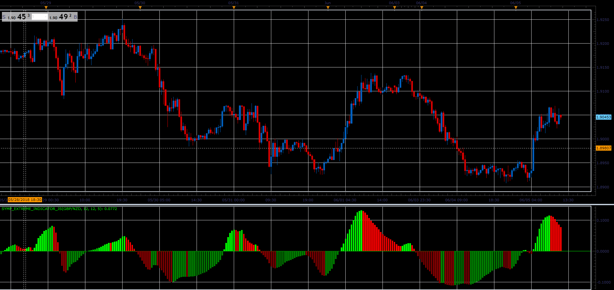
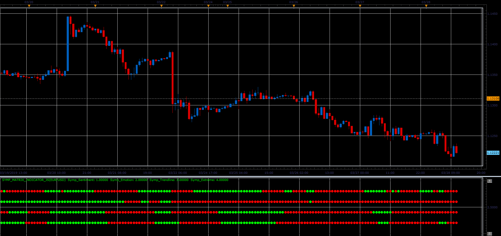
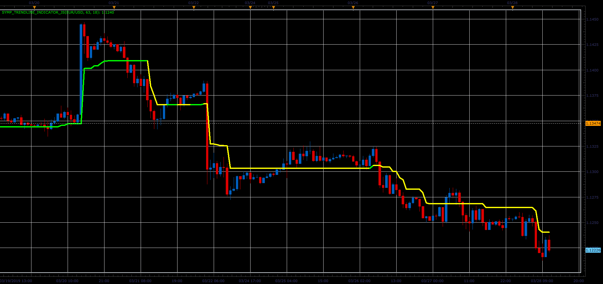

# Symphonie extreme indicator

> Source: https://fxcodebase.com/code/viewtopic.php?f=48&t=66453  
> Forum: 48 · Topic 66453 · 3 post(s)

---

## Symphonie extreme indicator

**Alexander.Gettinger** · Tue Aug 07, 2018 11:49 am

Download:

 [Symp_Extreme_Indicator_JS.jsl](files/120410/Symp_Extreme_Indicator_JS.jsl)

---

## Re: Symphonie extreme indicator

**Alexander.Gettinger** · Sat Mar 30, 2019 4:07 pm

**Symphonie Matrix indicator.**

Heatmap of the Symphonie indicators.

 

Download:

 [Symp_Matrix_Indicator_JS.jsl](files/125500/Symp_Matrix_Indicator_JS.jsl)

---

## Re: Symphonie extreme indicator

**Alexander.Gettinger** · Sat Mar 30, 2019 4:08 pm

**Symphonie Trendline indicator.**

Formulas:
Symp_Trendline=Low-ATR, if CCI>=0,
Symp_Trendline=High+ATR, if CCI<0.

 

Download:

 [Symp_Trendline_Indicator_JS.jsl](files/125501/Symp_Trendline_Indicator_JS.jsl)
