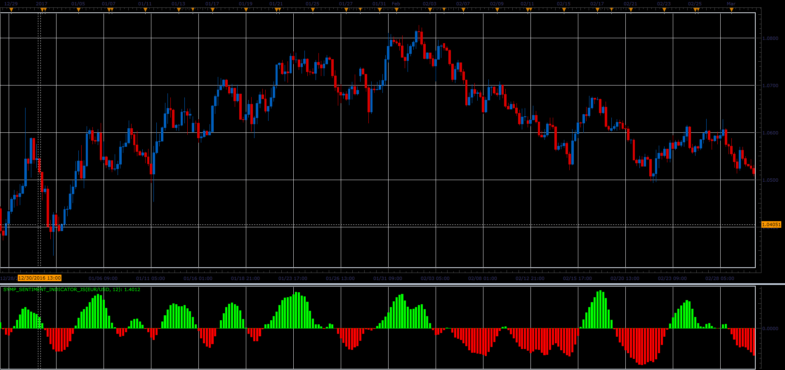

# Symphonie Sentiment indicator

> Source: https://fxcodebase.com/code/viewtopic.php?f=48&t=64745  
> Forum: 48 · Topic 64745 · 3 post(s)

---

## Symphonie Sentiment indicator

**Alexander.Gettinger** · Mon Jun 05, 2017 11:27 am

Formula:
Symp_Sentiment[i]=(Ln((1+St[i])/(1-St[i]))+Symp_Sentiment[i-1])/2, where
Ln() - natural logarithm,
St[i]=0.66*((Median[i]-Min)/(Max-Min)-0.5)+0.67*St[i-1],
Max and Min are a maximum and minimum prices at range from [i-Period] to [i].

 

Download:

 [Symp_Sentiment_Indicator_JS.jsl](files/112756/Symp_Sentiment_Indicator_JS.jsl)

MQ4/MT4 version.
[viewtopic.php?f=38&t=68168](https://fxcodebase.com/code/viewtopic.php?f=38&t=68168)

---

## Re: Symphonie Sentiment indicator

**oxbx99** · Fri Mar 22, 2019 2:28 pm

can i request to make mq4 version for this indicator please ??

thanks

---

## Re: Symphonie Sentiment indicator

**Apprentice** · Mon Mar 25, 2019 9:27 am

MQ4/MT4 version.
[viewtopic.php?f=38&t=68168](https://fxcodebase.com/code/viewtopic.php?f=38&t=68168)
