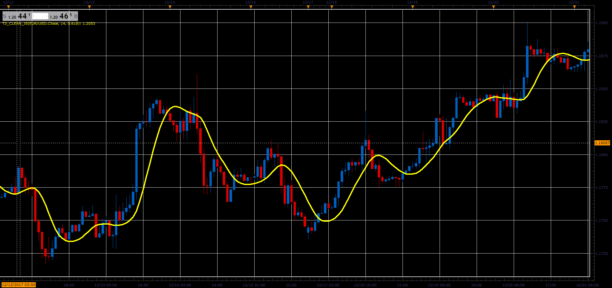

# T3 Clean indicator

> Source: https://fxcodebase.com/code/viewtopic.php?f=48&t=65592  
> Forum: 48 · Topic 65592 · 1 post(s)

---

## T3 Clean indicator

**Alexander.Gettinger** · Sat Jan 06, 2018 6:22 pm

Formulas:
T3[i]=c1*ae6[i]+c2*ae5[i]+c3*ae4[i]+c4*ae3[i], where
ae6[i]=w1*ae5[i]+w2*ae6[i-1],
ae5[i]=w1*ae4[i]+w2*ae5[i-1],
ae4[i]=w1*ae3[i]+w2*ae4[i-1],
ae3[i]=w1*ae2[i]+w2*ae3[i-1],
ae2[i]=w1*ae1[i]+w2*ae2[i-1],
ae1[i]=w1*Price[i]+w2*ae1[i-1],
c1=-b*b*b,
c2=3*(b*b+b*b*b),
c3=-3*(2*b*b+b+b*b*b),
c4=1+3*b+b*b*b+3*b*b,
w1=4/(3+Period),
w2=1-w1.

 

Download:

 [T3_Clean_JS.jsl](files/116871/T3_Clean_JS.jsl)
