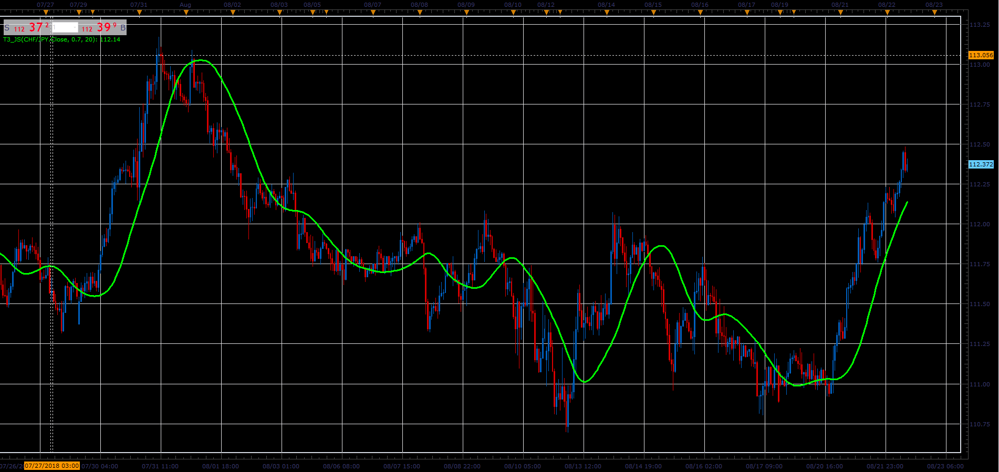

# T3 moving average

> Source: https://fxcodebase.com/code/viewtopic.php?f=48&t=66997  
> Forum: 48 · Topic 66997 · 1 post(s)

---

## T3 moving average

**Alexander.Gettinger** · Sat Nov 24, 2018 5:34 pm

T3 moving average is presented by Tim Tillson in S&C Magazine, 01/1998
Is a triple smoothed combination of the DEMA

T3 advantages
Less lag time, Line is much smoother, gives early entry signals, have smaller number of false signals.

 

Download:

 [T3_JS.jsl](files/122326/T3_JS.jsl)
