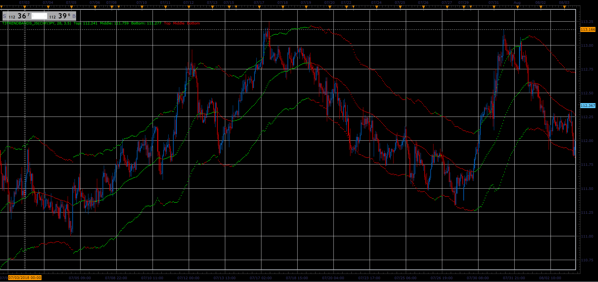

# T3Trend Bands

> Source: https://fxcodebase.com/code/viewtopic.php?f=48&t=66998  
> Forum: 48 · Topic 66998 · 1 post(s)

---

## T3Trend Bands

**Alexander.Gettinger** · Sat Nov 24, 2018 5:36 pm

Formulas:
MiddleLine[i]=(MiddleLine[i-1]*(BandBars-1)+Close[i])/BandBars,
TopLine[i]=MiddleLine[i]+SmoothRange[i],
BottomLine[i]=MiddleLine[i]-SmoothRange[i], where
SmoothRange[i]=(SmoothRange[i-1]*(BandBars-1)+High[i]-Low[i])/BandBars.

 

Download:

 [T3TrendBands_JS.jsl](files/122327/T3TrendBands_JS.jsl)
