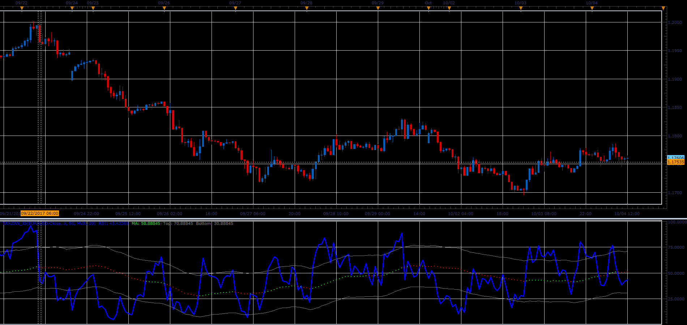

# Tarzan oscillator

> Source: https://fxcodebase.com/code/viewtopic.php?f=48&t=65276  
> Forum: 48 · Topic 65276 · 1 post(s)

---

## Tarzan oscillator

**Alexander.Gettinger** · Sat Oct 28, 2017 12:05 pm

Basically this is the RSI indicator.
Unlike the standard version,
which has same OB / OS zones values from period to period.
Tarzan Zone values will fluctuate in relation to the central line.
Central line is moving average of RSI.

 

Download:

 [Tarzan_JS.jsl](files/115701/Tarzan_JS.jsl)
