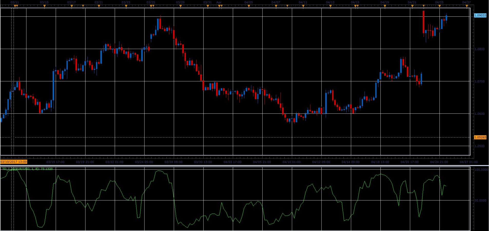

# TD_I indicator

> Source: https://fxcodebase.com/code/viewtopic.php?f=48&t=64746  
> Forum: 48 · Topic 64746 · 1 post(s)

---

## TD_I indicator

**Alexander.Gettinger** · Mon Jun 05, 2017 11:31 am

Formula:
TD_I = 100*High_Avg/(High_Avg+Low_Avg), where
High_Avg - Average value of High_Diff at range from (i-Period+1) to (i),
Low_Avg - Average value of Low_Diff at range from (i-Period+1) to (i),
High_Diff[i] = High[i]-High[i-Shift],
Low_Diff[i] = Low[i]-Low[i-Shift].

 

Download:

 [TD_I_JS.jsl](files/112757/TD_I_JS.jsl)
