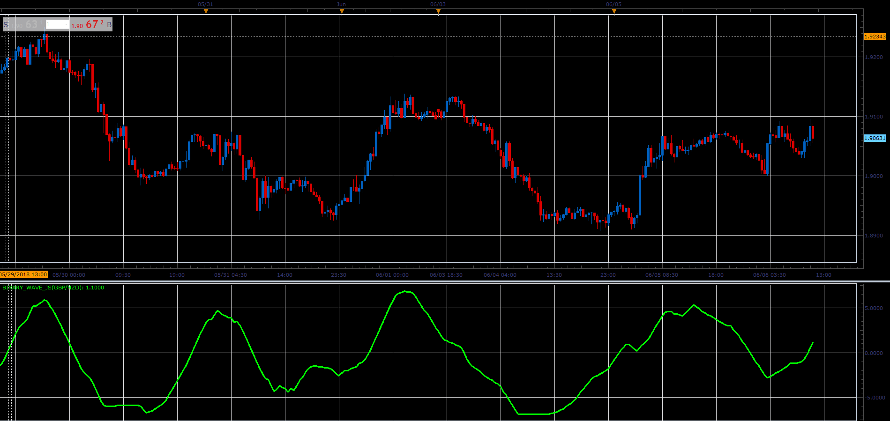

# The Binary Wave

> Source: https://fxcodebase.com/code/viewtopic.php?f=48&t=66515  
> Forum: 48 · Topic 66515 · 1 post(s)

---

## The Binary Wave

**Alexander.Gettinger** · Wed Aug 15, 2018 2:15 pm

Download:

 [Binary_Wave_JS.jsl](files/120577/Binary_Wave_JS.jsl)

For this indicator must be installed AVERAGES indicator ([viewtopic.php?f=17&t=2430](https://fxcodebase.com/code/viewtopic.php?f=17&t=2430)).
For this indicator must be installed MOMENTUM indicator
[viewtopic.php?f=17&t=896&p=100786&hilit=MOMENTUM#p100786](https://fxcodebase.com/code/viewtopic.php?f=17&t=896&p=100786&hilit=MOMENTUM#p100786)
