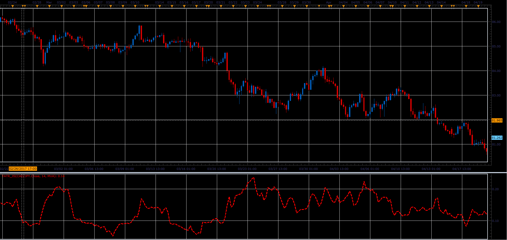

# Tick ATR

> Source: https://fxcodebase.com/code/viewtopic.php?f=48&t=64855  
> Forum: 48 · Topic 64855 · 1 post(s)

---

## Tick ATR

**Alexander.Gettinger** · Wed Jun 28, 2017 12:04 pm

This is a simplified version of the ATR.
So that it can be applied for Tick sources.

Explanation.
ATR is calculated as.
Average of True Range (TR).

True Range can be defined as.
The larger value of.
1) Current High less the current Low
2) Current High less the previous Close (absolute value)
3) Current Low less the previous Close (absolute value)

Tick ​​True Range can be defined as.
Current Close less the previous Close (absolute value)

 

Download:

 [TATR_JS.jsl](files/113247/TATR_JS.jsl)
