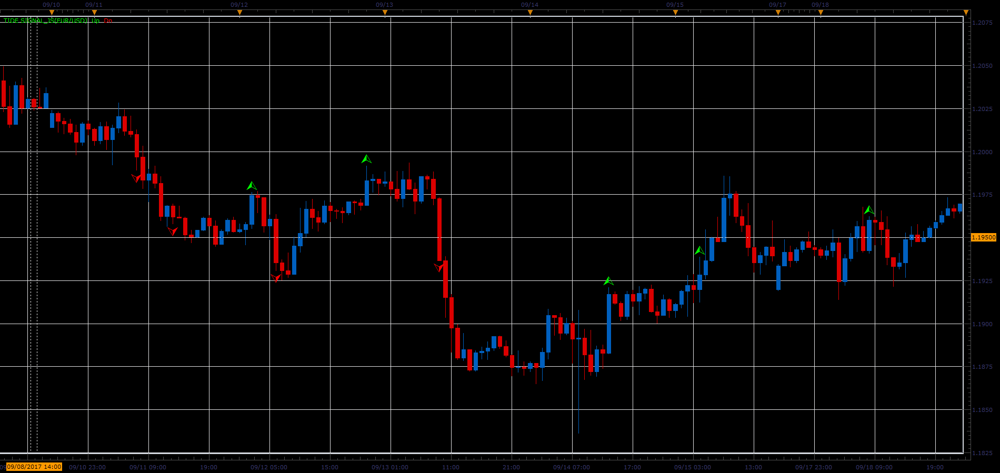

# Tide Signal

> Source: https://fxcodebase.com/code/viewtopic.php?f=48&t=65281  
> Forum: 48 · Topic 65281 · 1 post(s)

---

## Tide Signal

**Alexander.Gettinger** · Sat Oct 28, 2017 12:41 pm

Up Arrow
If Close CrossOver MA of High
and CMO breaking above the 0 line
and CCI> 100
and ADX> 20 line
and DMI +> DMI-

Down Arrow
If Close CrossUnder MA of Low
and CMO breaking below the 0 line
and CCI <-100
and ADX> 20 line
and DMI + <DMI-

 

Download:

 [Tide Signal_JS.jsl](files/115706/Tide%20Signal_JS.jsl)
